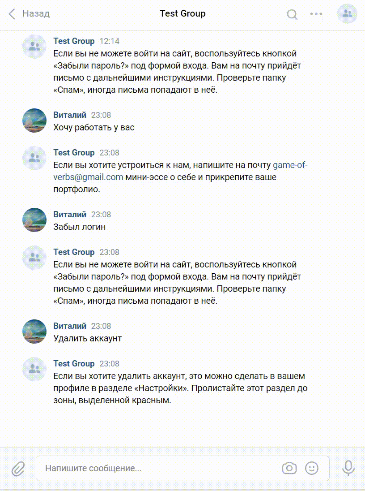

# Бот помощник для тех поддержки
[](https://www.python.org/)
[](https://vk.com/)
[](https://telegram.org/)
## Описание
Данная программа подключается к  [Telegram](https://telegram.org/) и [VK](https://vk.com), и используя нейросети от [Dialog_flow](https://dialogflow.cloud.google.com) для ответов на вопросы.

## Как установить
 - Склонировать проект
```shell
git clone https://github.com/toshiharu13/responding_bot.git
```
 - Установить requirements.txt
```shell
pip install -r requirements.txt
```
 - Создать файл .env и заполнить в нем переменные:
 
```dotenv
TG_BOT_TOKEN = 'токен бота от имени которого будут идти оповещения'
```
```dotenv
VK_API_KEY = 'ID телеграм чата для администратора(куда будут передаваться технические сообщения)'
```
```dotenv
TG_BOT_TOKEN = 'ID телеграм бота'
```
```dotenv
DF_PROJECT_ID = 'ID проекта Dialog_flow'
```
```dotenv
GOOGLE_APPLICATION_CREDENTIALS = 'путь до файла json c аутентификационными данными Dialog_flow'
```
## Запуск
Запуск телеграм бота
```shell
python tel_bot.py
```
Запуск VK бота
```shell
python vk_bot.py
```

## обучение бота
Загрузка обучающих фраз в Dialog_flow
```shell
python new_intent.py
```
Для обучения нужно разместить файл в формате json с данными для обучения в корне проекта

## Примеры использования
[телеграм бот](https://t.me/test_elf_bot)


[VK_bot](https://vk.com/club207675974)


В качестве тестирования к нейросети подключены интент "Приветствия" и интент "Устройство на работу"

## Цель проекта
Код написан в рамках самостоятельного проекта на онлайн-курсе для веб-разработчиков [Devman](https://dvmn.org).